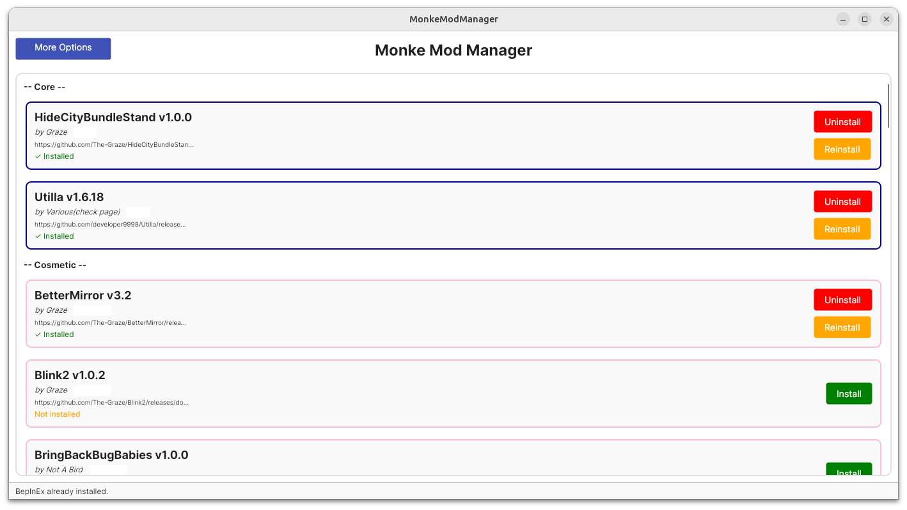
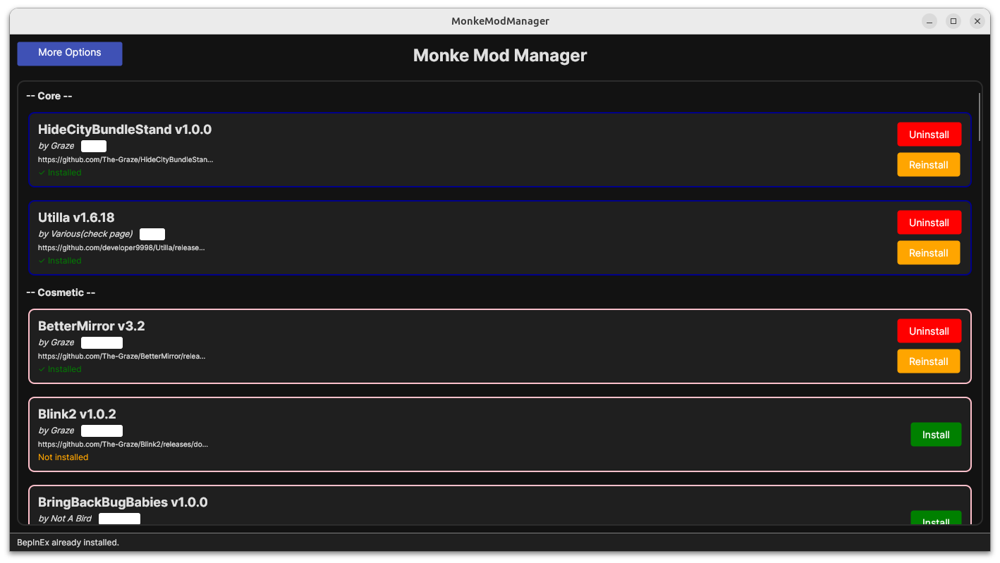

# 🍌 Banana Mod Manager

A fast, cross-platform mod manager for [Gorilla Tag](https://www.gorillatagvr.com/). Download, install, update, and manage your mods from one clean window — built with [Avalonia UI](https://avaloniaui.net/) on .NET 9.

<p align="center">
  
  &nbsp;
  
</p>

## Features

- 🛠️ One-click mod install, update, and uninstall
- 📂 Install mods from disk (`.dll`)
- 🚀 Launch Gorilla Tag (Steam)
- ⚙️ Built-in config editor for your mods
- 🍃 Enable/disable all mods without uninstalling them
- 🔄 Automatic BepInEx installation and configuration
- 🎨 Multiple themes (light, dark, high contrast, and more)
- 📡 Live mod list kept up to date with the community
- 🎮 Discord Rich Presence

## Download

| Platform | Download |
| -------- | -------- |
| Windows (x64) | [BananaModManager.exe](https://github.com/Snoopy941/Banana-Mod-Manager/releases/latest/download/BananaModManager.exe) |
| Linux (x64) | [BananaModManager](https://github.com/Snoopy941/Banana-Mod-Manager/releases/latest/download/BananaModManager) |

> ℹ️ Current releases are built from the **Debug** configuration and are intended for testing and feedback.

On Linux, make the binary executable before running it:

```bash
chmod +x BananaModManager
./BananaModManager
```

## Building from source

Requirements: [.NET 9 SDK](https://dotnet.microsoft.com/download/dotnet/9.0)

```bash
# Build (Debug)
dotnet build

# Publish self-contained, single-file binaries for Windows and Linux
./build.ps1
```

## License

This project is licensed under the MIT License — see the [LICENSE](LICENSE) file for details.

## Legal

> This product is not affiliated with Another Axiom Inc. or its videogames Gorilla Tag and Orion Drift, and is not endorsed or otherwise sponsored by Another Axiom. Portions of the materials contained herein are property of Another Axiom. ©2021 Another Axiom Inc.

Enjoy! 🍌
